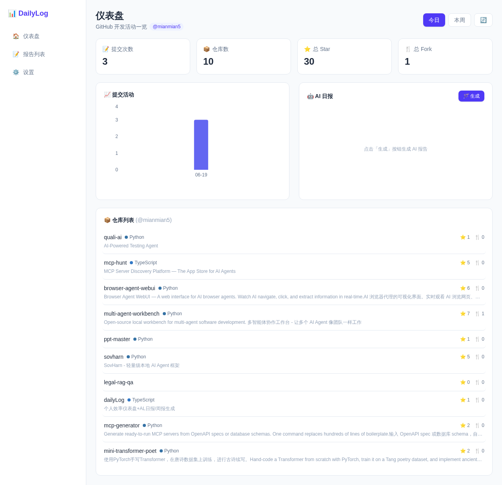
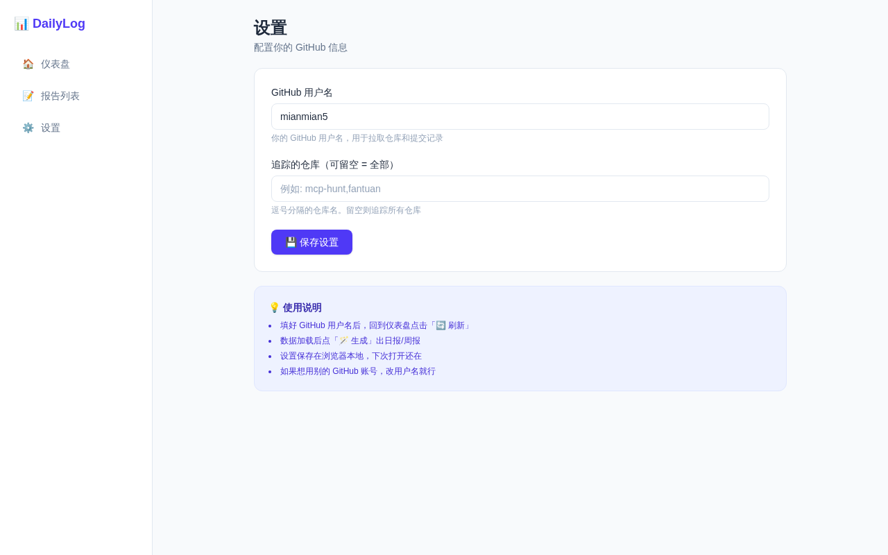
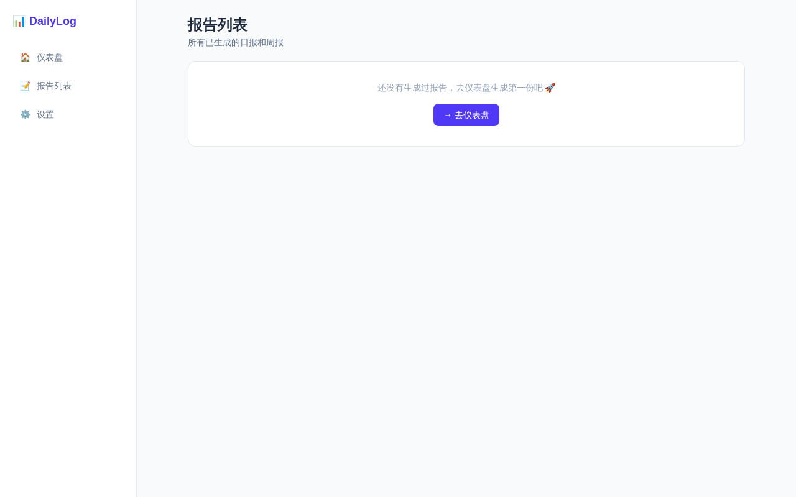

# 📊 DailyLog — 个人 GitHub 效率仪表盘 + AI 日报/周报

> 自动追踪你的 GitHub 开发活动，AI 生成日报/周报，让你对每天的产出心中有数。

## ✨ 功能

- **GitHub 活动总览** — 提交次数、仓库数、Star/Fork 一目了然
- **提交活动图表** — 每日提交趋势可视化
- **AI 日报/周报** — 一键生成基于 DeepSeek 的智能工作汇报
- **仓库列表** — 所有仓库的 Star、语言、描述概览
- **报告历史** — 查看和管理所有已生成的报告
- **可配置** — 支持自定义 GitHub 用户名和追踪仓库

## 🚀 快速开始

```bash
git clone https://github.com/mianmian5/dailyLog.git
cd dailyLog
npm install
# 配置环境变量
cp .env.example .env
# 编辑 .env 填入你的 DeepSeek API Key 和 GitHub Token
npm run dev
```

## 📸 截图

| 仪表盘 | 设置 |
|-------|------|
|  |  |

| 报告列表 |
|---------|
|  |

## 🌐 在线访问

➡️ [https://zybit.top/dailylog/](https://zybit.top/dailylog/)

> 注意：在线版使用公开 GitHub API 获取数据，AI 日报功能需在设置页配置你的 GitHub 用户名（仅存储在浏览器 localStorage 中）。

## ⚙️ 环境变量

| 变量 | 说明 | 必填 |
|------|------|------|
| `DEEPSEEK_API_KEY` | DeepSeek API Key，用于 AI 生成日报 | ✅ |
| `GITHUB_TOKEN` | GitHub Personal Access Token，提高 API 限频 | ❌ |
| `GITHUB_USERNAME` | 默认 GitHub 用户名 | ❌ |
| `TRACKED_REPOS` | 默认追踪仓库（逗号分隔） | ❌ |

## 🧩 技术栈

- **框架**: Next.js 16 + React 19
- **语言**: TypeScript
- **样式**: Tailwind CSS 4
- **图表**: Recharts
- **AI**: DeepSeek API

## 📄 License

MIT
