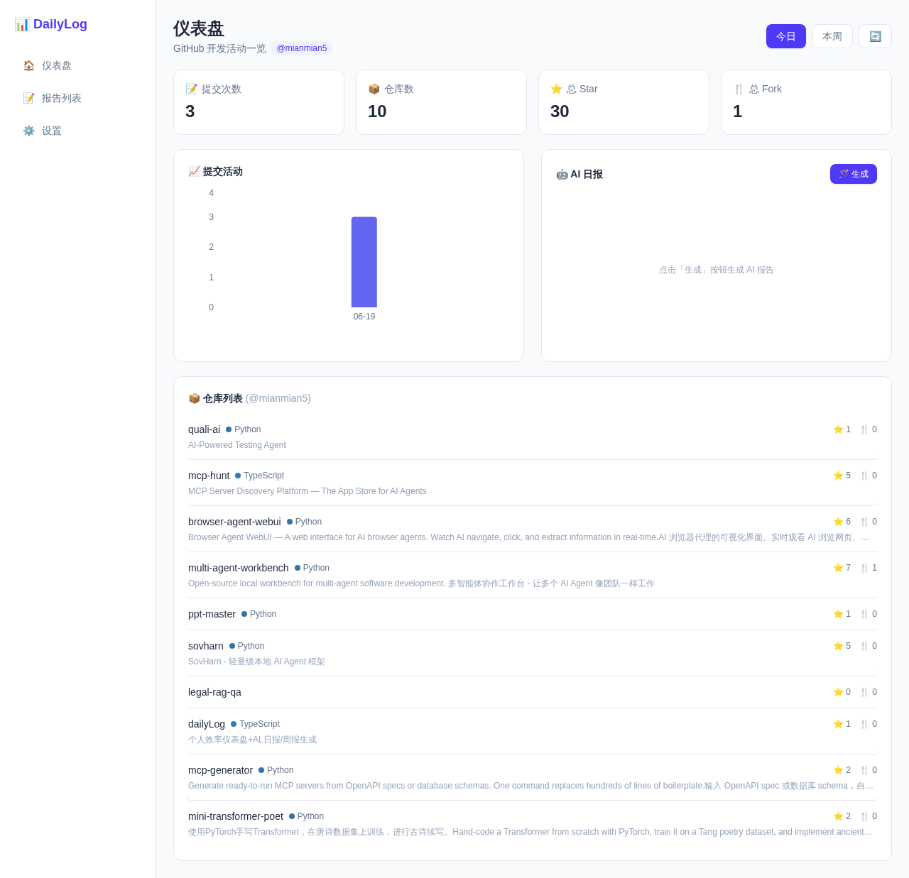
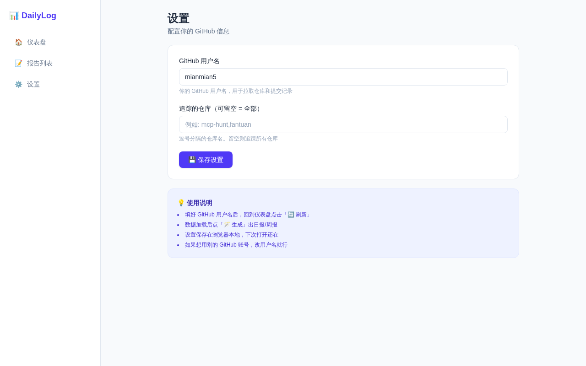
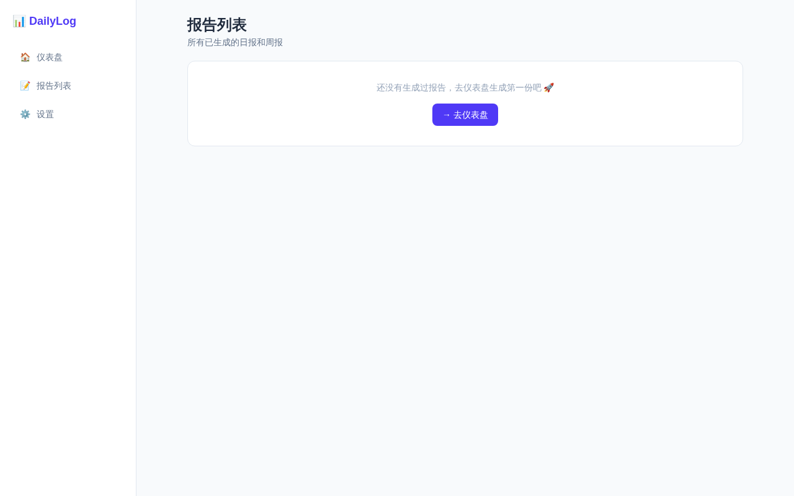

# 📊 DailyLog — 个人 GitHub 效率仪表盘 + AI 日报/周报

> 自动追踪你的 GitHub 开发活动，AI 生成日报/周报，让你对每天的产出心中有数。


## ✨ 功能

- **GitHub 活动总览** — 提交次数、仓库数、Star/Fork 一目了然
- **提交活动图表** — 每日/每周提交趋势可视化
- **AI 日报/周报** — 一键生成基于 DeepSeek 的智能工作汇报
- **仓库列表** — 所有仓库的 Star、语言、描述概览
- **报告历史** — 查看和管理所有已生成的报告
- **可配置** — 设置页支持自定义 GitHub 用户名和追踪仓库（存储在 localStorage）

## 📸 截图

| 仪表盘 | 设置 |
|-------|------|
|  |  |

| 报告列表 |
|---------|
|  |

## 🚀 快速开始

```bash
git clone https://github.com/mianmian5/dailyLog.git
cd dailyLog
npm install

# 配置环境变量
cp .env.example .env.local
# 编辑 .env.local 填入你的 DeepSeek API Key（必填）和 GitHub Token（可选）

npm run dev
```

打开 http://localhost:3000 查看效果。

## ⚙️ 环境变量

| 变量 | 说明 | 必填 |
|------|------|------|
| `DEEPSEEK_API_KEY` | DeepSeek API Key，用于 AI 生成日报 | ✅ |
| `GITHUB_TOKEN` | GitHub Personal Access Token，提高 API 限频 | ❌ |
| `GITHUB_USERNAME` | 默认 GitHub 用户名（可在设置页覆盖） | ❌ |
| `TRACKED_REPOS` | 默认追踪仓库，逗号分隔（可在设置页覆盖） | ❌ |

## 🧩 技术栈

- **框架**: Next.js 16 + React 19 (App Router)
- **语言**: TypeScript
- **样式**: Tailwind CSS 4
- **图表**: Recharts
- **AI**: DeepSeek API
- **数据**: GitHub REST API (Octokit)

## 📁 项目结构

```
src/
├── app/
│   ├── page.tsx              # 仪表盘主页
│   ├── reports/page.tsx      # 报告历史
│   ├── settings/page.tsx     # 设置页
│   └── api/
│       ├── github/commits/   # GitHub 提交数据 API
│       ├── report/daily/     # AI 日报生成
│       ├── report/weekly/    # AI 周报生成
│       └── reports/          # 报告存储 API
├── components/dashboard/     # 仪表盘组件
│   ├── stats-card.tsx
│   ├── commit-activity.tsx
│   ├── repo-list.tsx
│   └── report-panel.tsx
└── lib/
    ├── github.ts             # GitHub API 封装
    ├── ai.ts                 # DeepSeek 调用
    ├── config.ts             # localStorage 配置
    ├── api.ts                # 前端 API 路径助手
    └── store.ts              # 报告本地存储
```

## 📄 License

MIT
